= Lab 1-1: OpenShiftクラスターへのログインと動作確認

各自のOpenShiftクラスターに実際に接続し、クラスター内コンポーネントの動作確認を次の手順で行います。

* A) OpenShiftクラスターへのログイン (1-1-2)
* B) Project(openshift-console)のリソース利用状況の確認 (1-1-3-2)
* C) クラスターを構成するNodeの確認 (1-1-3-3)
* D) ワークロード の動作確認 (1-1-3-4)

image::images/ocp4ws-ops/ocp4-Lab1-2_overview.png[]

'''

== 1-1-1. 諸注意

=== 1-1-1-1. OpenShiftへのログイン方法
* *OpenShift Webコンソール* : OpenShiftの専用コンソール画面にブラウザからログイン
 ** PodやDeployment、Secretなどのワークロードや、ServiceやPVCなどの作成および編集
 ** ワークロードやNodeの状態確認やモニタリング
 ** カタログからのミドルウェア、アプリケーションのデプロイ
 ** クラスター設定やNamespace、ロール管理などのAdmin作業
 ** etc.

=== 1-1-1-2. 事前準備
* OpenShiftクラスターへのアクセス情報

== 1-1-2. OpenShiftへのログイン

=== 1-1-2-1 OpenShift Webコンソールへのログイン

ブラウザ(Chrome or Firefox)でOpenShift Webコンソールにログインします。

OpenShift WebコンソールのRULは、etherpad OpenShift WebコンソールのURLを参照ください。

`userX` としてログインしましょう。パスワードはetherpadの OpenShiftユーザのパスワードを参照ください。
(etherpadで予約したuser1,user2などのIDです)

---

=== 1-1-2-2. Webターミナルの確認

. Webターミナルは、Webコンソール上でシェルターミナルが利用できる機能です。
Webコンソールの画面右上にある >_ となっているアイコンをクリックします。

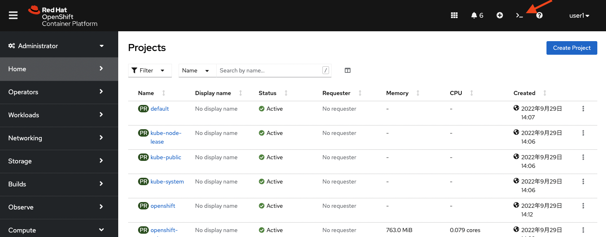

・アイコンをクリックすると、Webコンソールの画面下に Webターミナルが表示されます。
　Webターミナルは、Webターミナルの箱矢印のボタンを押すと、別ウィンドウで表示もできます。

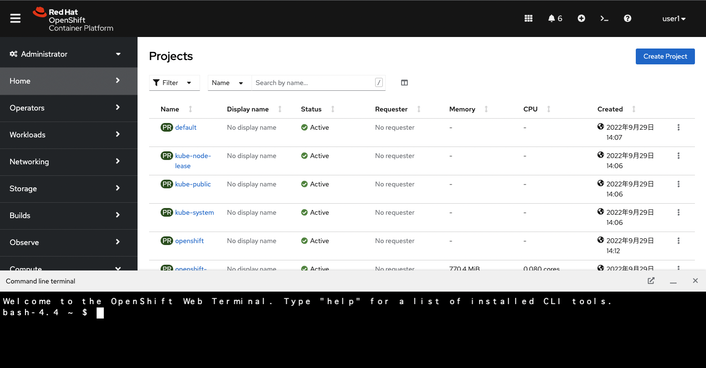

試しにログインしているユーザーの情報を表示する``oc whoami``コマンドを実行してみましょう。``userX``と表示されるはずです。

[source,bash,role="execute"]
----
oc whoami
----

出力例)

----
$ oc whoami
userX
----

== 1-1-3. OpenShiftクラスターの動作確認

Webコンソールや``oc``コマンドを使って、クラスターの状態について確認してみましょう。

=== 1-1-3-1. Projectの作成とリソース利用状況の確認

Webコンソールで**Project**を作成してみます。 +
Projectとはクラスター内で他のアプリケーションや他のユーザーと作業空間を分離する、名前空間(Namespace)としての役割を持ちます。そのためProjectの名前はクラスター内で一意であることが必要となります。

. **[Administrator] > [Home] > [Projects] > [Create Project]** を選択します。
+
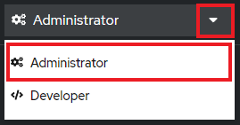
+
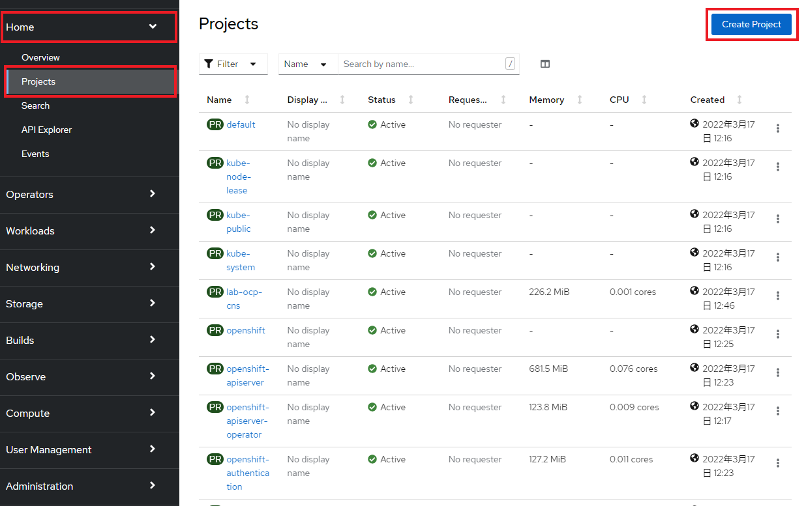
+
. **"Name"**にProject名として``userX-lab1``(他の名前でも構いません)を指定し、**Create** を選択します。
+
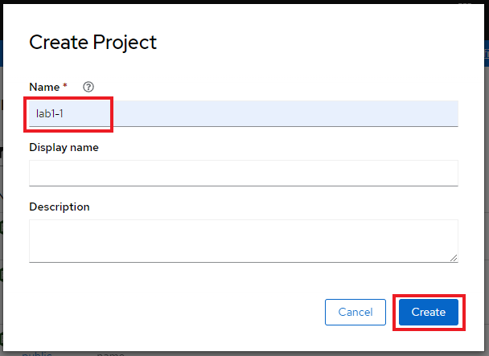
+
すると、作成したProjectの詳細が表示されます。
+
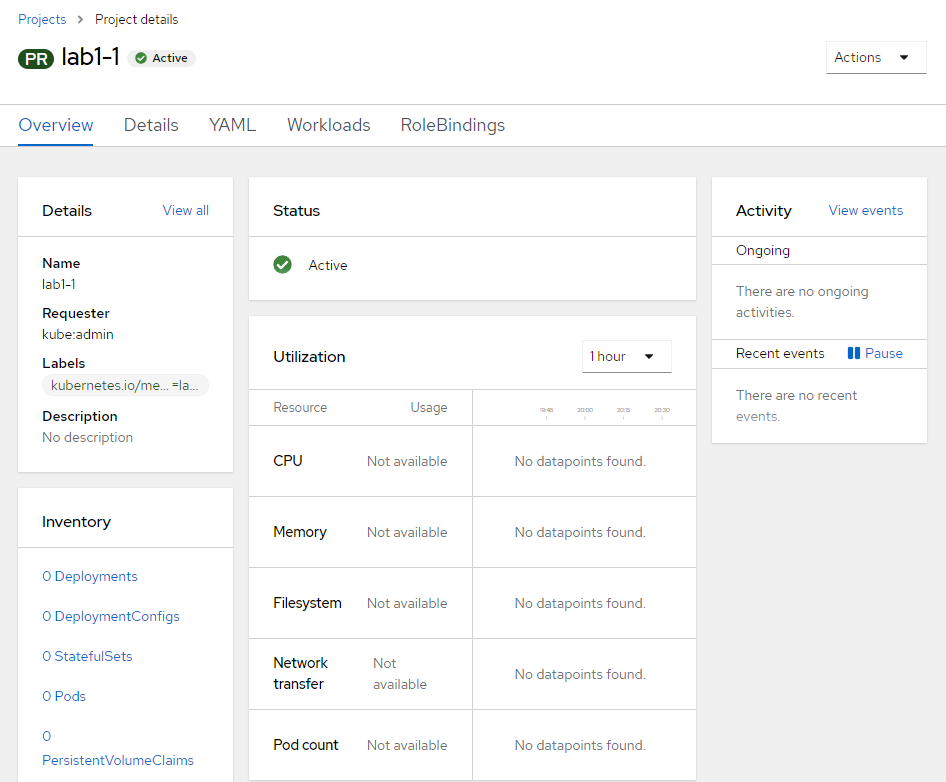

---

=== 1-1-3-2. Projectのリソース利用状況の確認
Projectのリソース利用状況を確認します。 +
OpenShiftクラスターには複数のProjectが存在します。Projectの一覧は、Webコンソールで　**[Administrator] > [Home] > [Projects]** から確認することができます。 +
Projectの詳細はこの一覧からProjectを選択することで確認できます。例えば、先程作成した``lab1-1``を選択すると、Project作成後に表示されたものと同じ画面が表示されます。 +

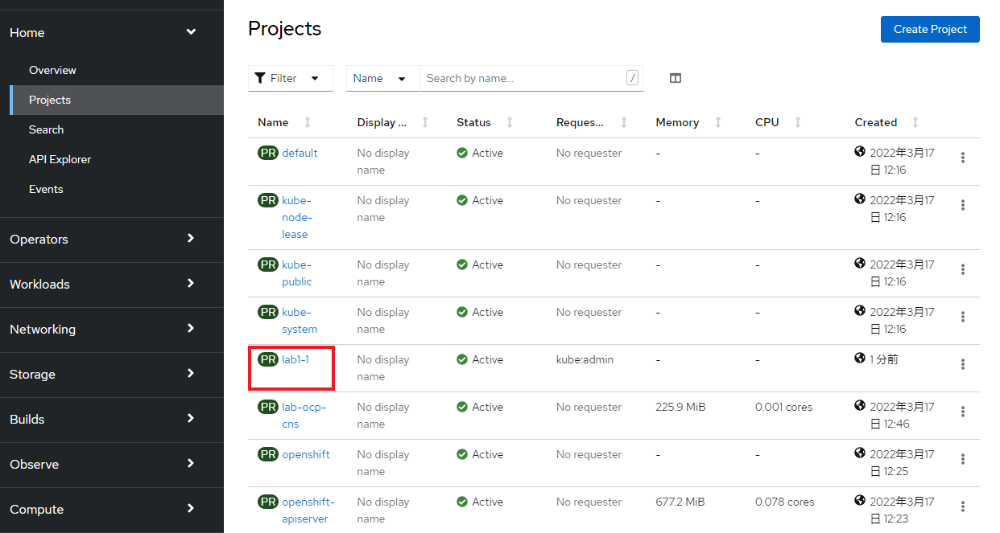

作成したばかりのProjectは特にリソースを使っていないので、利用状況の情報がありません。ですので、別のProjectとして``openshift-console``を選んでみましょう。
[TIPS]
====
NOTE: ``openshift-console`` Projectは、まさに今皆さんが使っているWebコンソールを提供するWebアプリケーションのProjectです。 +
OpenShiftには他にも様々な機能やツールが存在しますが、それらのほとんどはWebコンソールと同じように、クラスターにおいてProjectで安全に分離されたアプリケーションとして提供されています。
====

. **[Administrator] > [Home] > [Projects] > [openshift-console]** を選択します。
+
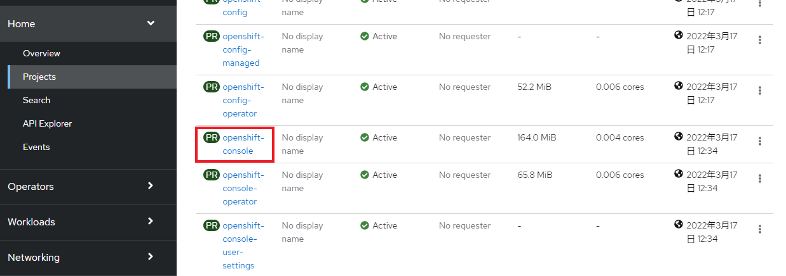
+
``openshift-console`` Projectの画面で、CPUやメモリなどのリソース利用状況が確認できます。 +
さらに下方では、**Pod**によるメモリ利用量と、利用量の大きい順にTOP10が一覧表示されています。
+
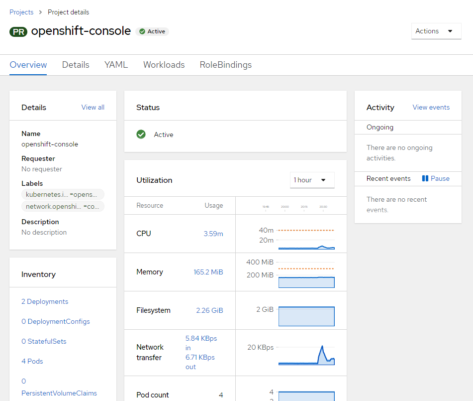

. ``openshift-console`` Projectの利用状況について詳細に見ていきましょう。中央の"Utilization"のボックスにあるCPUのグラフにマウスカーソルを重ねてクリックしてみましょう。
+
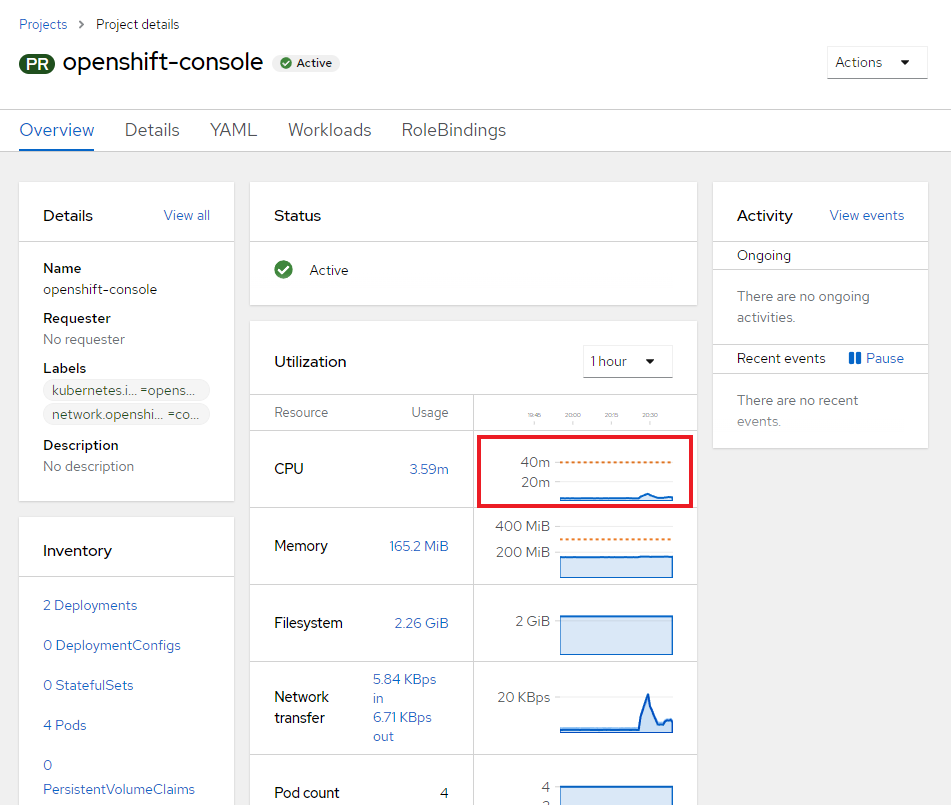
+
グラフをクリックすると、より詳細なCPU利用量のグラフが表示されているはずです。このグラフはOpenShiftクラスターに組み込まれた"Prometheus"というツールを使用しています。 +
+
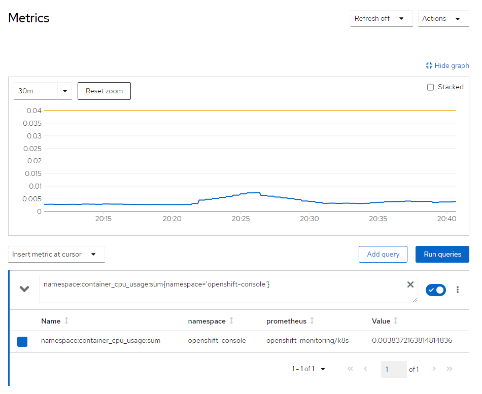
+
次に、Prometheus自身が提供するdashboard(Prometheus Expression Browser)にアクセスしてみましょう。 +
Prometheusのdashboardは次のリンク先からアクセスできます。
+

https://prometheus-k8s-openshift-monitoring.{{ ROUTE_SUBDOMAIN }}

+
ログインを求められる場合は、**[Log in with OpenShift]** のボタンをクリックし、OpenShiftクラスターへのログイン情報を使用してログインします。 +
`kubeadmin`ユーザーのパスワードは下の通りです。
+
[source,role="copypaste"]
----
{{ KUBEADMIN_PASSWORD }}
----
+
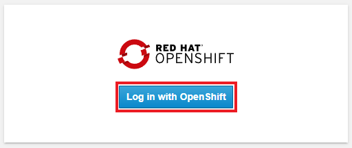
+
"Authorized Access"のページが表示されたら、**[Allow selected permissions]**を選択します。これによって、クラスターに組み込まれたPrometheusに対して自身のアカウント(``kubeadmin``)の情報をReadOnlyで利用する許可を与えます。
+
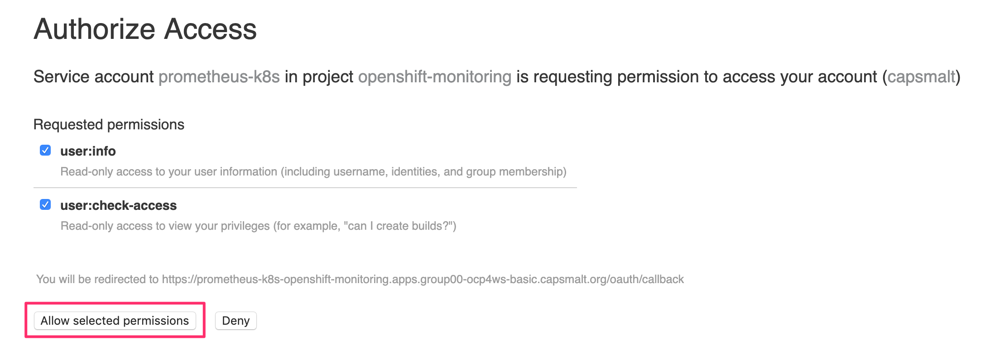
+
すると、左上にPrometheusと表示された画面に移ります。これがPrometheusのdashboardです。 +
先程の `openshift-console` ProjectのCPU利用状況をグラフ表示してみましょう。 +
+
*Expression (press Shift+Enter for newlines)* と表示されているクエリボックスに、次のクエリを入力して、**Execute** ボタンを押します。
+
[source,role="copypaste"]
----
namespace:container_cpu_usage:sum{namespace='openshift-console'}
----
+
すると、
``openshift-console``Project内のコンテナCPU利用量のグラフが描画されます。折れ線グラフにカーソルを合わせると詳細情報が表示されます。
+
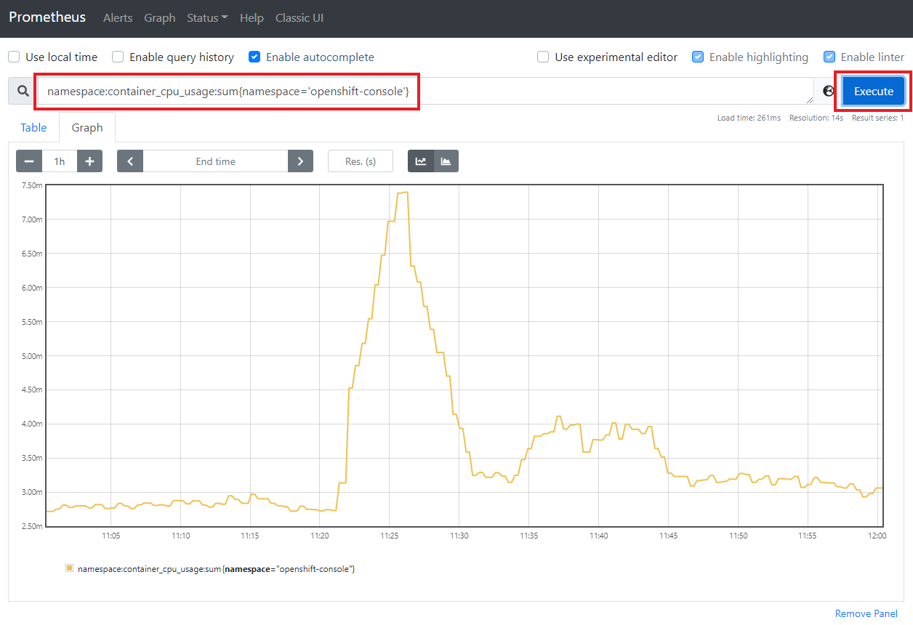
+
. Prometheusで任意のメトリクスを指定して描画してみます。
+
入力済のクエリを削除してブランクにしてから、次のように入力してみましょう。
+
[source,role="copypaste"]
----
controller_runtime_
----
+
すると、自動補完機能が働いて、自動的に候補となるクエリがリストされます。クエリを完全に覚えていなくてもよいので、便利な機能です。 +
それではこの中から、`controller_runtime_reconcile_total` を選択して、**Execute** ボタンを押します。
+
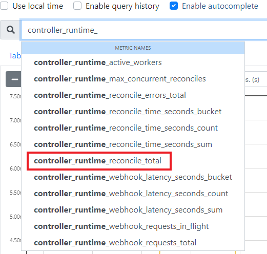
+
以下図のように折れ線グラフが描画され、下部にはリクエストが一覧されています。カーソルをグラフなどに合わせて詳細情報を確認してみましょう。もしうまく描画されない場合は、検索クエリが正しく指定されているか(``controller_runtime_reconcile_total``)を確認してみましょう。
+
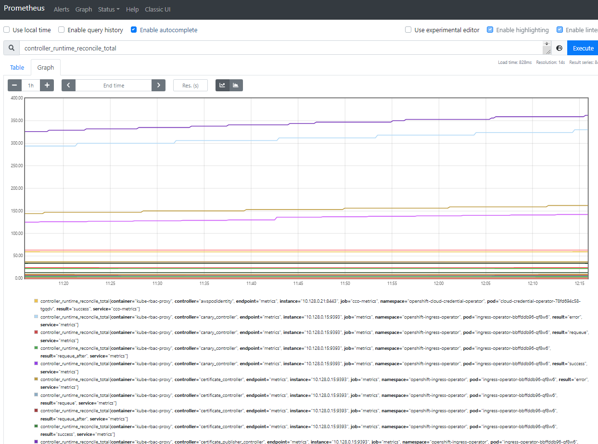
+
[TIPS]
====
NOTE: OpenShiftでは、各Project(Namespace)に属するあらゆるリソースのメトリクスを初期状態で取得できるようになっています。PrometheusやGrafanaなどを使うことでモニタリングおよび描画を実現しています。
====
+
. "Grafana"というツールを使ってリソースを確認することも可能です。[Administrator] > [Observe] > [Dashboards]から確認してみましょう。
+
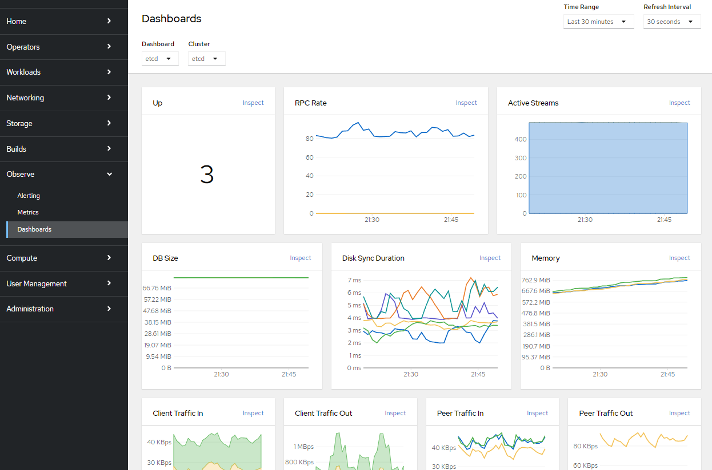
+
. 現在開いているタブ（Prometheus UI (あるいはGrafana)）は、**モニタリングやロギングなど短期間で更新される画面であるため、ブラウザに負荷がかかります。**このため、必ずクローズしておきましょう。

---

=== 1-1-3-3. クラスターを構成するNodeの確認

OpenShiftクラスターはIPIでデフォルト構成でインストールされた場合、Master3台/Worker3台の計6台のNode群で構成されます。 +
Nodeの状態について確認してみましょう。

*※ノード台数や構成は変更できます。ハンズオン実施時は6台構成ではない場合もあります。*

. [Administrator] > [Compute] > [Nodes] を選択します。
+
. 任意のWorkerを選択して詳細を確認します。
+
[TIPS]
====
NOTE: `ip-10-0-152-9.us-east-2.compute.internal` のような名称で、Node群が一覧されています。また、Role欄を見ると `master`/``worker``の割当を確認できます。※Node数や名称は一例です。
====
+
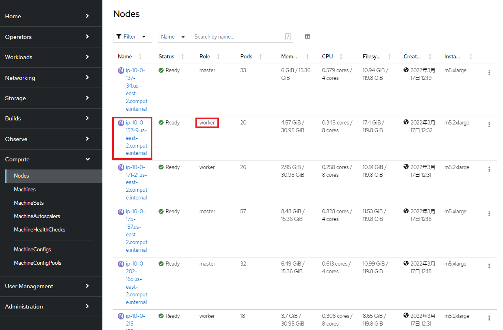
+
[Overview]タブでは、選択した単一のNodeのCPUやメモリなどのリソース利用状況が確認できます。 +
Projectと同様に、にデフォルト構成されているPrometheusが各メトリクスを抽出しています。
+
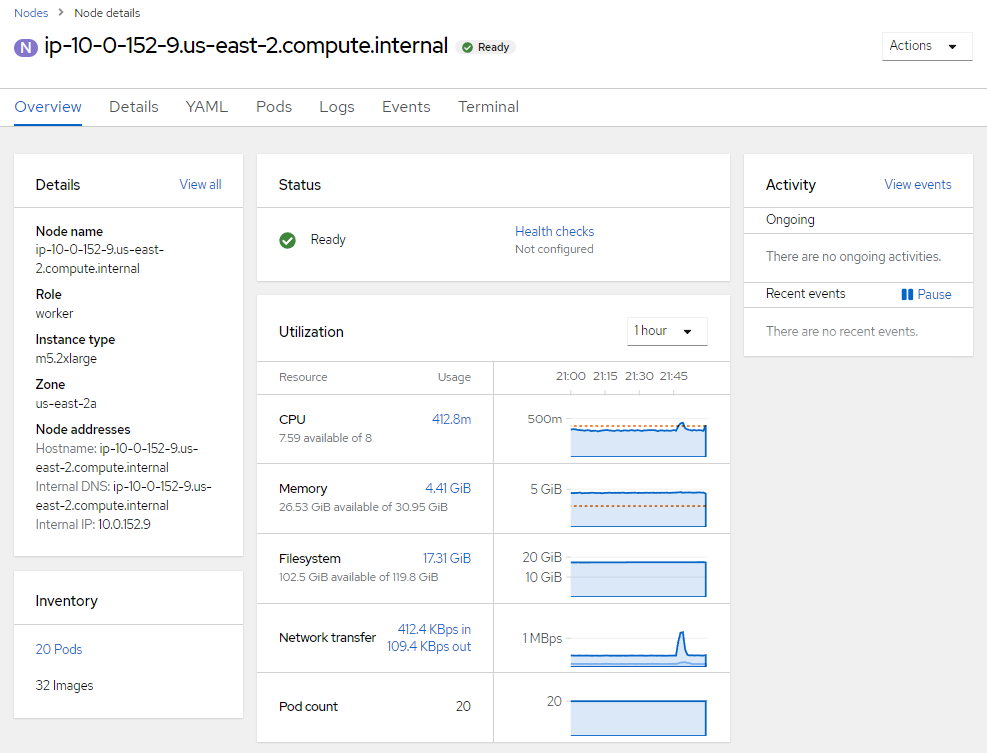
+
[YAML]タブでは、OpenShift上で管理されるNode情報をyaml形式で確認できます。ノード名やアノテーション、ラベルなどの記載があります。
+
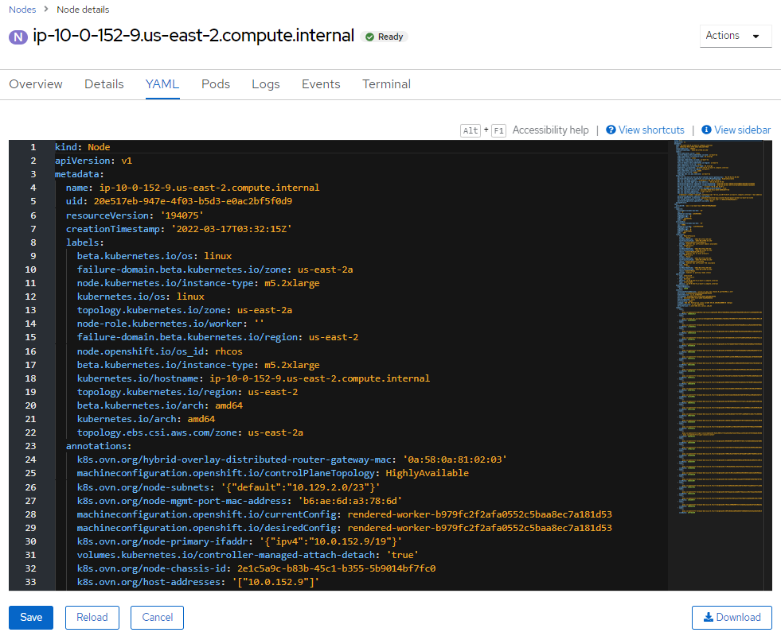
+
[Pods]タブでは、指定したNode上で動作するPod一覧を確認できます。 +
例えば、``openshift-monitoring``Namespaceに属するGrafanaのPodや、alertManagerなどが動作していることが分かります。
+
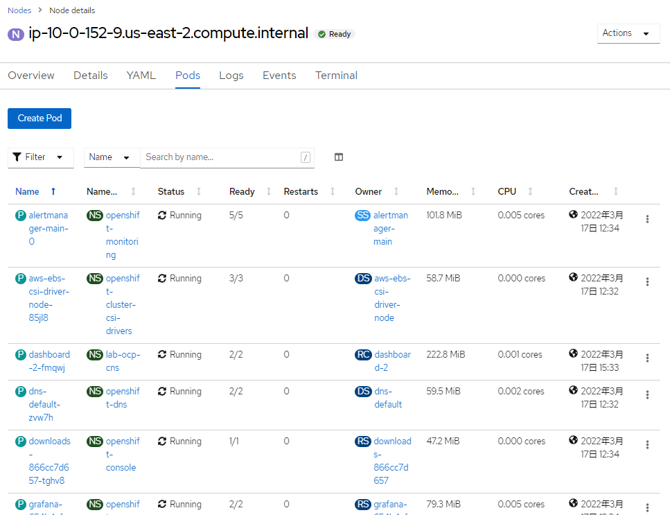
+
[Events]タブでは、Nodeに起こったイベントについて時系列に表示されます。現時点では何も起こっていないので出力はありませんが、Nodeのステータスが変わったり、例えば割当リソースが変わったりなどの変化が起こると出力されます。

. Nodeに対する操作(Action)を以下図のようにメニューを開いて確認します。
+
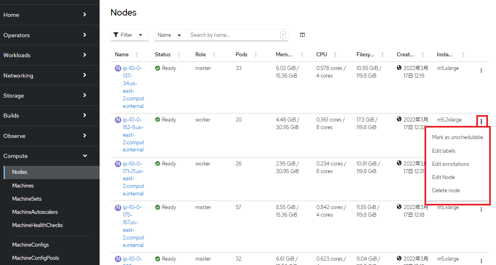
+
[Mark as Unschedulable] のメニューでは、今後新しいPodが該当Nodeにスケジューリングされないように設定できます。今回は編集しないので、*[Cancel]* を選択してクローズします。
+
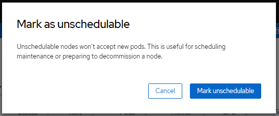
+
[Edit labels] のメニューでは、ラベルの追加や削除などの変更をUI上で簡単に行えます。今回は編集しないので、*[Cancel]* を選択してクローズします。
+
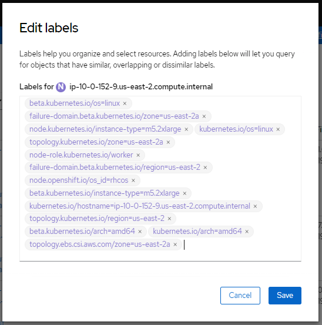
+
[Edit annotations] のメニューも同様で、アノテーションの追加や削除などの変更をUI上で簡単に行えます。今回は編集しないので、*[Cancel]* を選択してクローズします。
+
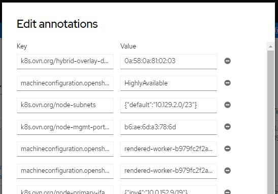
+
また、[Edit annotations] のメニューを選ぶと、先のNode情報の[YAML]タブの画面に移ります。ここで直接編集してNode構成の変更が行えます。 +

コンソール上で、OpenShiftクラスターを構成するNodeの数や種類、付与されたラベル、リソース利用状況、あるNode上で動作中のPod、Nodeの構成変更、などについて確認しました。

---

=== 1-1-3-4. ワークロード の動作確認 (ocコマンド使用)
``oc``コマンドを使用して、ワークロードの動作状況を確認してみましょう。

. クラスターに含まれるProjectを一覧します。
+
[source,bash,role="execute"]
----
oc get project
----
+
実行例)
+
----
$ oc get project
NAME                                               DISPLAY NAME   STATUS
default                                                           Active
kube-node-lease                                                   Active
kube-public                                                       Active
kube-system                                                       Active
lab-ocp-cns                                                       Active
lab1-1                                                            Active
openshift                                                         Active
openshift-apiserver                                               Active
openshift-apiserver-operator                                      Active
openshift-authentication                                          Active
openshift-authentication-operator                                 Active
openshift-cloud-controller-manager                                Active
openshift-cloud-controller-manager-operator                       Active
openshift-cloud-credential-operator                               Active
openshift-cluster-csi-drivers                                     Active
openshift-cluster-machine-approver                                Active
openshift-cluster-node-tuning-operator                            Active
openshift-cluster-samples-operator                                Active
openshift-cluster-storage-operator                                Active
openshift-cluster-version                                         Active
openshift-config                                                  Active
openshift-config-managed                                          Active
openshift-config-operator                                         Active
openshift-console                                                 Active
openshift-console-operator                                        Active
openshift-console-user-settings                                   Active
openshift-controller-manager                                      Active
openshift-controller-manager-operator                             Active
openshift-dns                                                     Active
openshift-dns-operator                                            Active
openshift-etcd                                                    Active
openshift-etcd-operator                                           Active
openshift-host-network                                            Active
openshift-image-registry                                          Active
openshift-infra                                                   Active
openshift-ingress                                                 Active
openshift-ingress-canary                                          Active
openshift-ingress-operator                                        Active
openshift-insights                                                Active
openshift-kni-infra                                               Active
openshift-kube-apiserver                                          Active
openshift-kube-apiserver-operator                                 Active
openshift-kube-controller-manager                                 Active
openshift-kube-controller-manager-operator                        Active
openshift-kube-scheduler                                          Active
openshift-kube-scheduler-operator                                 Active
openshift-kube-storage-version-migrator                           Active
openshift-kube-storage-version-migrator-operator                  Active
openshift-kubevirt-infra                                          Active
openshift-machine-api                                             Active
openshift-machine-config-operator                                 Active
openshift-marketplace                                             Active
openshift-monitoring                                              Active
openshift-multus                                                  Active
openshift-network-diagnostics                                     Active
openshift-network-operator                                        Active
openshift-node                                                    Active
openshift-oauth-apiserver                                         Active
openshift-openstack-infra                                         Active
openshift-operator-lifecycle-manager                              Active
openshift-operators                                               Active
openshift-ovirt-infra                                             Active
openshift-ovn-kubernetes                                          Active
openshift-service-ca                                              Active
openshift-service-ca-operator                                     Active
openshift-user-workload-monitoring                                Active
openshift-vsphere-infra                                           Active
----
+
. 1-1-3-1. で作成した自身のProjectを検索し、操作対象として切替えます。
+
[TIPS]
====
CAUTION: 作成したProjectの名前が"lab1-1"でない場合は、各自のProject名に置き替えてください。
====
+

+
[source,bash,role="copypaste"]
----
oc get project | grep lab1-1
----
+
実行例)
+
----
$ oc get project | grep lab1-1
lab1-1                                                                 Active
----
+
Projectを切替えて操作してみましょう。
+
[source,bash,role="copypaste"]
----
oc project lab1-1
----
+
実行例)
+
----
$ oc project lab1-1
Now using project "lab1-1" on server "https://api.cluster-XXXX.XXXX.sandboxYYYY.opentlc.com:6443".
----
+
[TIPS]
====
TIP: `$ oc project` でProject（Namespace）を指定しておくことで、``-n lab1-1`` のようにコマンド実行時に毎度Namespace指定をする必要が無くなるため幾分便利になります。 +
====
+
. 自身のProject内のワークロードを確認します。
+

[source,bash,role="copypaste"]
----
oc get pod -n lab1-1
----
+
[source,bash,role="copypasete"]
----
oc get deploy -n lab1-1
----
+
[source,bash,role="copypasete"]
----
oc get svc -n lab1-1
----
+
実行例)
+
----
$ oc get pod -n lab1-1
No resources found.

$ oc get deploy -n lab1-1
No resources found.

$ oc get svc -n lab1-1
No resources found.
----
+
自身のProjectでは、まだ何もワークロードを作成していないため、上記例の通り "No resource found." が出力されます。
+
. openshift-console Project のワークロードを確認します。
+
[source,bash,role="execute"]
----
oc get pod -n openshift-console
----
+
[source,bash,role="execute"]
----
oc get deploy -n openshift-console
----
+
[source,bash,role="execute"]
----
oc get svc -n openshift-console
----
+
実行例)
+
----
$ oc get pod -n openshift-console
NAME                         READY   STATUS    RESTARTS   AGE
console-855bff5f9c-rhnmm     1/1     Running   0          16h
console-855bff5f9c-xvttg     1/1     Running   1          16h
downloads-5dc69d497c-7kvxb   1/1     Running   0          16h
downloads-5dc69d497c-dxvz7   1/1     Running   0          16h

$ oc get deploy -n openshift-console
NAME        READY   UP-TO-DATE   AVAILABLE   AGE
console     2/2     2            2           16h
downloads   2/2     2            2           16h

$ oc get svc -n openshift-console
NAME        TYPE        CLUSTER-IP       EXTERNAL-IP   PORT(S)   AGE
console     ClusterIP   172.30.159.179   <none>        443/TCP   16h
downloads   ClusterIP   172.30.220.192   <none>        80/TCP    16h
----

``oc``コマンドは、Kubernetesを拡張したOpenShiftの制御をシンプルに行うために用意されているCLIですが、``kubectl``と同じ制御が行えます。例えば、``kubectl describe pod``と同じ操作を `oc describe pod` で行えます。余談ですが、もちろん``kubectl``コマンドをOpenShiftで使うこともできます。

OpenShiftによって拡張された機能については、次のハンズオン(link:ocp4ws-ops-1-2[コンテナイメージのビルドとデプロイ])で体験できます。

'''

以上で、Lab1-1: OpenShiftクラスターへのログインと動作確認は完了です。 +
次に link:ocp4ws-ops-1-2[Lab1-2: コンテナイメージのビルドとデプロイ] のハンズオンに進みます。
