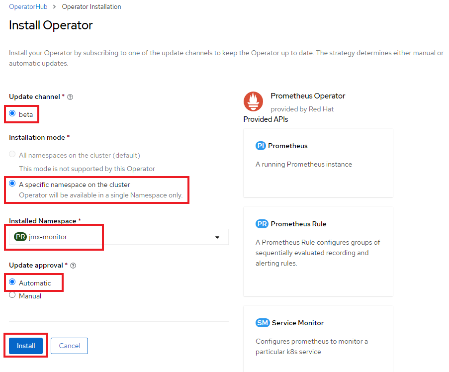
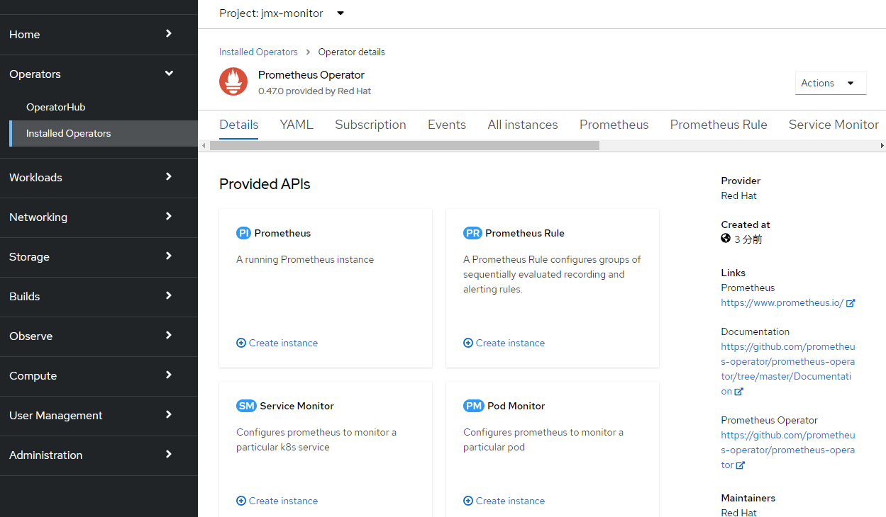

= Lab1-4: Prometheus Operatorの展開

== 1-4-1. 諸注意

=== 1-4-1-1. Prometheus Operatorについて

Prometheus Operatorは、Kubernetesサービスの簡単な監視定義、およびPrometheusインスタンスの展開と管理を提供します。  +
Prometheus Operatorは次の機能を提供します。

* 容易なPrometheusの作成/破棄：Kubernetes名前空間、特定のアプリケーション、またはチーム用のPrometheusインスタンスをOperatorを使って簡単に起動できます。
* シンプルな設定：CRDを通してPrometheusのバージョン、永続性、保存ポリシー、レプリカなどの基本設定ができます。
* ラベルを介したターゲット：Kubernetesラベルクエリに基づいて、監視ターゲット構成を自動的に生成します。そのため、Prometheus固有の言語を学ぶ必要がありません。

=== 1-4-1-2. 事前準備

* 事前にJMX Exporterを用意しておく。
* OpenShiftクラスターへのアクセス情報

== 1-4-2. Prometheus Operatorの展開

=== 1-4-2-1. Project作成
Prometheus Operator用の"userX-jmx-monitor"という名前のProjectを作成します。**以降のLab1-4の作業は全て"userX-jmx-monitor"Projectで行います**。念のため``oc project``コマンドで現在指定しているProjectが"userX-jmx-monitor"であることを確認して下さい。

[source,bash,role="execute"]
----
oc new-project userX-jmx-monitor 
----
[source,bash,role="execute"]
----
oc project
----

実行例)

----
$ oc new-project user1-jmx-monitor
Now using project "user1-jmx-monitor" on server "https://api.cluster-8a39.8a39.sandbox135.opentlc.com:6443".

You can add applications to this project with the 'new-app' command. For example, try:

    oc new-app rails-postgresql-example

to build a new example application in Ruby. Or use kubectl to deploy a simple Kubernetes application:

    kubectl create deployment hello-node --image=k8s.gcr.io/serve_hostname

$ oc project
Using project "user1-jmx-monitor" on server "https://api.cluster-8a39.8a39.sandbox135.opentlc.com:6443".
----

---

=== 1-4-2-2. Prometheus Operatorのインストール

OpenShift Webコンソールにログインし、[Operators]>[OperatorHub]から"Prometheus"を検索します。 +
この際、Projectが**"userX-jmx-monitor"**であることを確認しておきましょう。

image::images/ocp4ws-ops/operator-hub.png[OperatorHub]

OperatorHubの中から、Prometheus Operator(Community)を選択して、[Install]を行います。 +
※コミュニティ版を利用すると、警告が表示されるので、一旦[Continue]で続けます。

image::images/ocp4ws-ops/prometheus-operator.png[Prometheus Operator]

image::images/ocp4ws-ops/prometheus-operator-subscription.png[]

"Install Operator"の画面では、以下の設定を指定して**Install**をクリックします。

* Update Channel +
**beta**
* Installation Mode +
**A specific namespace on the cluster**
* Installed Namespace +
**userX-jmx-monitor**
* Approval Strategy +
**Automatic**

実際のGUI上では以下のように設定します。

正しく設定されると、[View Operator]からPrometheus Operatorが確認できます。また、下図のように[Operators]>[Installed Operators]からでも辿ることができます。

image::images/ocp4ws-ops/prometheus-subscription.png[Prometheus Subscription]

これで、Prometheus Operatorがインストールされました。なおこの時点では、Custom Resource Definition(CRD)の登録やPrometheus Operatorの配置が行われるだけで、Prometheusのプロセス自体はまだ構築されません。

[TIPS]
====
TIP: **Operatorの一覧を``oc``コマンドで確認する**

OperatorHubの画面で表示されるOperatorの一覧は、``oc``コマンドでも見ることができます。

[source,bash,role="execute"]
----
oc get packagemanifest -n openshift-marketplace
----

次のように、``oc describe``を使うことでWebコンソールのOperatorHubでは表示されないような、各Operatorの詳細な情報を得ることができます。

[source,bash,role="execute"]
----
oc describe packagemanifest prometheus -n openshift-marketplace
----

例えば、Installation Modeに注目してみると、Webコンソールでは、

* All namespaces on the cluster 
* A specific namespace on the cluster

の2つが表示されていました。一方、`oc describe` の出力では、次のような表示を見つけることができます。
----
      Install Modes:
        Supported:  true
        Type:       OwnNamespace
        Supported:  true
        Type:       SingleNamespace
        Supported:  false
        Type:       MultiNamespace
        Supported:  true
        Type:       AllNamespaces
----
これらのInstall Modeは下表のような特徴があります。内部的にはこれらをtrueとfalseで制御をしていることがわかります。
|===
| InstallMode | Action

| OwnNamespace
| Operatorは、独自のnamespace を選択するOperatorGroupのメンバーにできます。

| SingleNamespace
| Operatorは1つのnamespace を選択するOperatorGroupのメンバーにできます。

| MultiNamespace
| Operatorは複数の namespace を選択するOperatorGroupのメンバーにできます。

| AllNamespaces
| Operatorはすべての namespace を選択するOperatorGroupのメンバーできます (ターゲット namespace 設定は空の文字列 "" です)。
|===
====

== 1-4-3. Custom Resource Definition(CRD)とOperatorの確認

Prometheus Operatorをインストールすると、CRD(Custom Resource Definition)が作成されます。Promethus Operatorは、標準で8つのCRDを保持しています。 +
Webコンソールでは [Operators]>[Installed Operators]>[Prometheus Operator] から、デプロイされたPromethus OperatorのCRDが確認できます。

[TIPS]
====
TIP: **CRDはProject無視？**

もちろんCRDは``oc``コマンドでも確認できます。``oc get crd``を実行すると作成されているCRDが表示されます。
[source,bash,role="execute"]
----
oc get crd
----
このコマンドの出力は、今回インストールしたPrometheus Operatorで作成されたCRD以外のものも表示していることがわかるでしょう。どうも、クラスターで作成されている全てのCRDが表示されているようです。これはなぜでしょうか？

それはCRDが、どのProjectでも利用できる**"Cluster-scoped"**なリソースであることが理由です。 +
通常、リソースは他のアプリケーションから分離されることが望ましいため、作成されたProject(Namespace)内で管理されます。こういったリソースは**"Namespace-scoped"**なリソースと呼ばれ、OpenShiftおよびKubernetesで利用される大半のリソースはこれにあたります。 +
一方で、Projectをまたいでクラスター全体で利用される方が効率的で望ましいリソースも中には存在し、こういったものが"Cluster-scoped"なリソースとして定義されています。CRDの他に例を挙げると、**StorageClass**や**ClusterRoles**などです。

幸い、今回インストールしたPrometheus Operatorで作成されたCRDにはlabelが付けられているため、label selectorで絞ることができます。
[source,bash,role="execute"]
----
oc get crd --show-labels -l operators.coreos.com/prometheus.jmx-monitor
----

実行例)

----
$ oc get crd --show-labels -l operators.coreos.com/prometheus.jmx-monitor
NAME                                        CREATED AT             LABELS
alertmanagerconfigs.monitoring.coreos.com   2022-03-17T03:17:16Z   operators.coreos.com/prometheus.jmx-monitor=
alertmanagers.monitoring.coreos.com         2022-03-17T03:17:19Z   operators.coreos.com/prometheus.jmx-monitor=
podmonitors.monitoring.coreos.com           2022-03-17T03:17:21Z   operators.coreos.com/prometheus.jmx-monitor=
probes.monitoring.coreos.com                2022-03-17T03:17:23Z   operators.coreos.com/prometheus.jmx-monitor=
prometheuses.monitoring.coreos.com          2022-03-17T03:17:26Z   operators.coreos.com/prometheus.jmx-monitor=
prometheusrules.monitoring.coreos.com       2022-03-17T03:17:28Z   operators.coreos.com/prometheus.jmx-monitor=
servicemonitors.monitoring.coreos.com       2022-03-17T03:17:30Z   operators.coreos.com/prometheus.jmx-monitor=
thanosrulers.monitoring.coreos.com          2022-03-17T03:17:33Z   operators.coreos.com/prometheus.jmx-monitor=
----
====

また、Operator自身もアプリケーションに他なりません。そのため、インストールされるPodとして稼働します。 +
``oc get pod``によって、Prometheus OperatorのPodがOLM(Operator Lifecycle Manager)によって配置されていることが確認できます。
[source,bash,role="execute"]
----
oc get pod
----

実行例)

----
$ oc get pod
NAME                                  READY   STATUS    RESTARTS   AGE
prometheus-operator-bd98985fd-vcnw6   1/1     Running   0          5m52s
----

'''

以上で、Promethus Operatorの準備が整いました。次のlink:ocp4ws-ops-1-5[CustomResourceの設定]作業に進みます。
